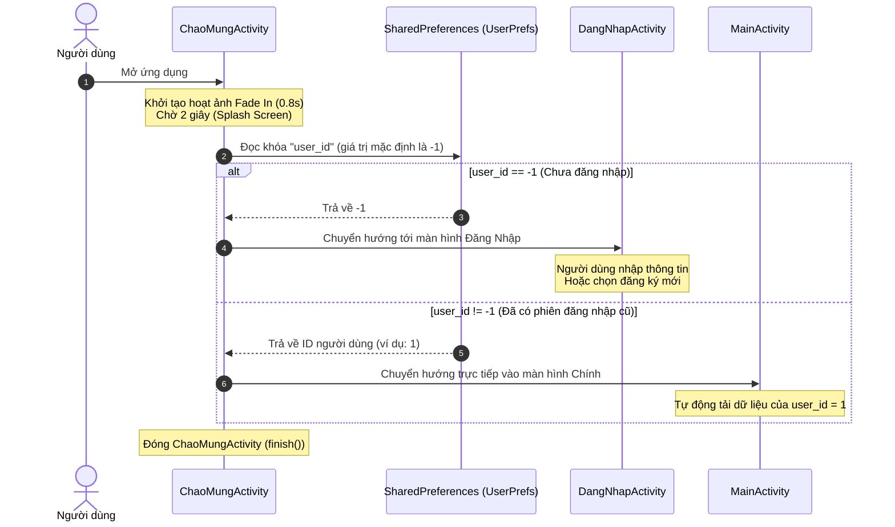
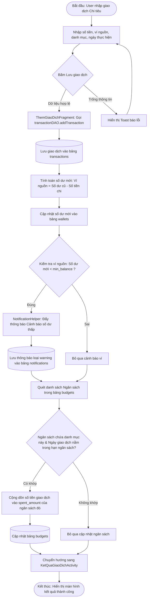
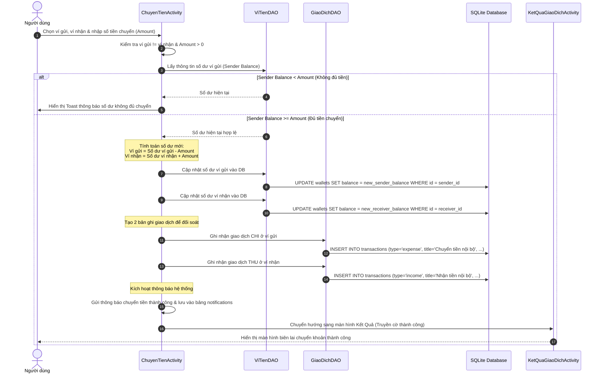
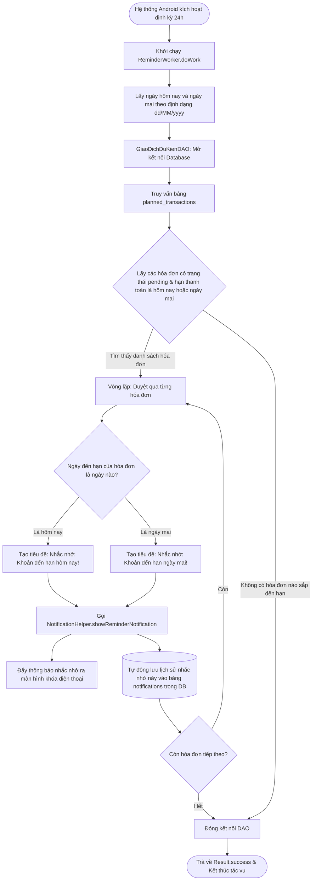

# Báo Cáo Tổng Hợp Hệ Thống & Phân Tích Luồng Xử Lý
## Dự Án: Ứng Dụng Quản Lý Chi Tiêu (Android)

---

## 1. Tổng Quan Hệ Thống & Công Nghệ Sử Dụng

Ứng dụng **Quản lý chi tiêu cá nhân** là một giải pháp di động chạy trên hệ điều hành Android, được thiết kế để hỗ trợ người dùng theo dõi dòng tiền, ghi chép giao dịch hàng ngày, đặt giới hạn chi tiêu qua ngân sách, lên lịch thanh toán các hóa đơn định kỳ, và phân tích thói quen tài chính thông qua các biểu đồ thống kê trực quan.

### 1.1. Công Nghệ Lõi (Core Technology Stack)
* **Ngôn ngữ phát triển:** Java (Android SDK).
* **Kiến trúc dữ liệu:** Sử dụng mô hình **DAO (Data Access Object)** phân tách tầng logic truy cập dữ liệu với giao diện (UI).
* **Hệ quản trị cơ sở dữ liệu:** **SQLite** (`DatabaseHelper` kế thừa từ `SQLiteOpenHelper`), hiện tại đang ở phiên bản database số **9** (hỗ trợ nhiều tài khoản người dùng và lưu trữ thông báo).
* **Tác vụ nền định kỳ:** **WorkManager** (`ReminderWorker`) thiết lập cơ chế chạy ngầm cứ sau mỗi 24 giờ để tự động quét kiểm tra các khoản hóa đơn sắp đến hạn và gửi thông báo nhắc nhở người dùng.
* **Lưu trữ phiên (Session Cache):** **SharedPreferences** (`UserPrefs`) lưu trữ khóa `user_id` và `username` để nhận diện phiên làm việc của người dùng đang đăng nhập, làm cơ sở truy vấn dữ liệu cá nhân hóa ở tất cả các bảng.
* **Thành phần giao diện (UI Elements):** 
  - Sử dụng **Single Activity Pattern** kết hợp với **Fragments** thông qua thanh điều hướng phía dưới (**BottomNavigationView**) và nút thêm nhanh (**FloatingActionButton**) ở giữa.
  - Sử dụng **Material Design Components** (CardView, MaterialButton, Dialogs...) giúp giao diện hiện đại và trực quan.
  - Tích hợp hiệu ứng hoạt ảnh mượt mà (**fade_in**, **fade_out**) khi chuyển đổi giữa các Fragment và màn hình chào mừng.

---

## 2. Báo Cáo Chi Tiết Các Chức Năng Cốt Lõi

Hệ thống được chia thành 8 module chức năng chính liên kết chặt chẽ với nhau:

```
                      +-----------------------------+
                      |     Authentication          |
                      | (Đăng nhập / Đăng ký / Sổ)  |
                      +--------------+--------------+
                                     |
                                     v
                      +--------------+--------------+
                      |      MainActivity (UI)      |
                      |   (Bottom Navigation / FAB) |
                      +-------+--------------+------+
                              |              |
        +---------------------+              +---------------------+
        |                     |              |                     |
        v                     v              v                     v
+-------+-------+     +-------+-------+     +-------+-------+     +-------+-------+
|    Trang Chủ  |     |   Ví Tiền     |     |   Danh Mục    |     |   Giao Dịch   |
| (Giao dịch gần|     | (Thêm/Chuyển/ |     | (Phân loại thu|     | (Ghi chép thu |
|  đây, Số dư)  |     |  Nạp tiền)    |     | /chi, Styling)|     |  /chi thực tế)|
+---------------+     +---------------+     +---------------+     +---------------+
        |                     |              |                     |
        +---------------------+--------------+---------------------+
                              |
        +---------------------+---------------------+
        |                     |                     |
        v                     v                     v
+-------+-------+     +-------+-------+     +-------+-------+
|   Ngân Sách   |     | Khoản Đến Hạn |     |   Thống Kê    |
| (Thiết lập hạn|     | (Lên lịch hóa |     | (Biểu đồ tròn/|
| mức chi tiêu) |     |  đơn dự kiến) |     | cột trực quan)|
+---------------+     +---------------+     +---------------+
                              |
                              v
                      +-------+-------+
                      |   Thông Báo   |
                      | (Cảnh báo số  |
                      | dư/hạn mức/hạn|
                      +---------------+
```

### 2.1. Quản lý Tài Khoản & Xác Thực (Authentication)
* **Màn hình chào mừng (`ChaoMungActivity`):** Hiển thị hoạt ảnh chuyển mờ (Fade In) trong 2 giây, tự động đọc SharedPreferences để kiểm tra session người dùng (`user_id`). Nếu đã đăng nhập, chuyển trực tiếp vào `MainActivity`, ngược lại chuyển sang `DangNhapActivity`.
* **Đăng ký tài khoản (`DangKyActivity`):** Yêu cầu nhập **Họ và tên (Bắt buộc)**, Tên đăng nhập (tối thiểu 4 ký tự, viết liền không dấu), Email hợp lệ, Mật khẩu (tối thiểu 6 ký tự). Họ tên là trường bắt buộc phải nhập khi đăng ký tài khoản mới. Mật khẩu được mã hóa một chiều qua thuật toán **SHA-256** (`SecurityUtils.hashPasswordSHA256`) trước khi lưu vào SQLite để bảo mật. Trường Họ tên được lưu vào cột `fullname` (bảng `users` phiên bản v10).
* **Đăng nhập (`DangKyActivity` / `DangNhapActivity`):** Băm mật khẩu người dùng nhập và đối chiếu với database thông qua `NguoiDungDAO`. Nếu đúng, lưu `user_id`, `username` và `fullname` vào SharedPreferences.
* **Hiển thị thông tin người dùng:** Hiển thị **Họ tên** của người dùng tại các màn hình chính bao gồm Trang chủ (`TrangChuFragment`) và Hồ sơ (`HoSoFragment`), nếu trống (do tài khoản cũ) sẽ hiển thị thông báo nhắc nhở cập nhật họ tên.
* **Chỉnh sửa Hồ sơ & Thiết lập (`CaiDatActivity`):** Cho phép người dùng chỉnh sửa thông tin cá nhân. Theo yêu cầu nghiệp vụ:
  - Chỉ cho phép hiển thị và sửa **Họ và tên** (cập nhật lại SQLite và SharedPreferences) và **Ảnh đại diện** thông qua hộp thoại sửa thông tin chung. Trường địa chỉ Email đã được lược bỏ khỏi hộp thoại này và cả Tên đăng nhập đều không được phép sửa để bảo vệ tính nhất quán tài khoản.
  - *Cơ chế lưu ảnh đại diện an toàn:* Khi người dùng chọn ảnh từ máy, ứng dụng sao chép ảnh vào thư mục bộ nhớ đệm (cache directory) tạm thời. Khi bấm "Lưu", ảnh sẽ được di chuyển chính thức vào thư mục lưu trữ nội bộ của app (`getFilesDir()/avatars/`) để tránh bị xóa bởi hệ thống và lưu đường dẫn tuyệt đối vào DB.
* **Đăng xuất:** Người dùng thực hiện đăng xuất thông qua nút Đăng xuất trực tiếp trong màn hình Hồ sơ (`HoSoFragment`) để thao tác nhanh hơn. Nút Đăng xuất tại màn hình Cài đặt (`CaiDatActivity`) đã được loại bỏ hoàn toàn để giao diện cài đặt gọn gàng và tránh trùng lặp tính năng. Hành động này sẽ xóa sạch bộ nhớ tạm SharedPreferences và điều hướng người dùng quay lại màn hình đăng nhập, xóa ngăn xếp Activity cũ.

### 2.2. Quản lý Ví Tiền (Wallet Management)
* **Thông tin cấu trúc ví:** Lưu trong bảng `wallets` gồm các thuộc tính: Số dư hiện tại, Loại ví (Tiền mặt, Ngân hàng, Ví điện tử), Đơn vị tiền tệ (VND, USD), Biểu tượng hiển thị, Màu sắc nền và Hạn mức số dư tối thiểu (`min_balance`) để nhận cảnh báo.
* **Nạp tiền (`NapTienActivity`):** Cho phép người dùng nạp thêm tiền vào ví đã chọn để tăng số dư khả dụng. Khi nạp thành công, hệ thống tự động ghi nhận giao dịch thuộc danh mục "Nạp tiền" và kích hoạt thông báo giao dịch thành công.
* **Chuyển tiền (`ChuyenTienActivity`):** Chia làm 2 chế độ:
  - *Chuyển tiền nội bộ (Internal Transfer):** Chuyển tiền qua lại giữa các ví của chính người dùng (ví dụ: rút tiền từ tài khoản Ngân hàng sang ví Tiền mặt). Hệ thống sẽ trừ tiền ở ví gửi, cộng tiền ở ví nhận, đồng thời tự động lưu 2 bản ghi giao dịch (một giao dịch chi tiền ở ví gửi, một giao dịch thu tiền ở ví nhận) để đảm bảo lịch sử giao dịch được đồng nhất.
  - *Chuyển khoản liên ngân hàng (Bank Transfer):** Chuyển tiền tới số tài khoản bên ngoài. Người dùng chọn ví nguồn, chọn Ngân hàng đích, nhập Số tài khoản thụ hưởng, Tên người nhận (tự động viết hoa) và Số tiền. Hệ thống sẽ trừ tiền ví nguồn và lưu lại một giao dịch chi tiền kèm ghi chú đầy đủ về tài khoản nhận tiền.

### 2.3. Quản lý Danh Mục Thu/Chi (Category Management)
* **Phân loại gốc:** Chia làm 2 nhóm lớn là `expense` (Chi tiêu) và `income` (Thu nhập).
* **Cá nhân hóa danh mục (`DanhMucFragment`):** Người dùng có thể tự định nghĩa các nhóm chi tiêu hoặc nguồn thu nhập mới (ví dụ: Ăn uống, Di chuyển, Lương, Thưởng...). Mỗi danh mục đi kèm với một **màu sắc đặc trưng** (lưu dạng mã Hex hoặc Integer) và **biểu tượng** (`icon`) riêng biệt giúp người dùng dễ dàng nhận diện khi xem lịch sử giao dịch hoặc biểu đồ thống kê.

### 2.4. Ghi Chép Giao Dịch (Transaction Management)
* **Tạo giao dịch mới (`ThemGiaoDichFragment`):** Người dùng nhập Số tiền (có định dạng hiển thị tiền tệ thực tế ví dụ: `50.000 ₫` ngay khi gõ), chọn Danh mục tương ứng, chọn Ví thanh toán, chọn Ngày giao dịch và viết ghi chú.
* **Xử lý số dư & Cập nhật tự động:**
  - Nếu là giao dịch **Chi tiêu (`expense`)**: Số dư của ví liên kết sẽ bị **trừ** đi. Đồng thời hệ thống sẽ chạy tiến trình phụ để kiểm tra xem số dư mới có thấp hơn hạn mức tối thiểu (`min_balance`) của ví đó hay không để gửi cảnh báo số dư thấp.
  - Nếu là giao dịch **Thu nhập (`income`)**: Số dư của ví liên kết sẽ được **cộng** thêm vào.
  - Cập nhật số tiền đã tiêu trong các ngân sách đang hoạt động có liên kết với danh mục chi tiêu này.
* **Xem lịch sử (`TrangChuFragment`):** Hiển thị tóm tắt tổng thu, tổng chi trong tháng hiện tại, hiển thị biểu đồ tròn sơ lược và danh sách các giao dịch được thực hiện gần đây nhất (sắp xếp thời gian mới nhất lên đầu).

### 2.5. Quản lý Ngân Sách (Budget Management)
* **Thiết lập giới hạn chi tiêu (`ThemNganSachActivity`):** Người dùng đặt tên ngân sách, chọn hạn mức tiền tối đa, thời gian áp dụng (ngày bắt đầu - ngày kết thúc) và tích chọn các danh mục chi tiêu muốn áp dụng (ví dụ: tạo ngân sách "Ăn uống & Mua sắm tháng 6" với hạn mức 5.000.000đ).
* **Kiểm soát chi tiêu tự động:** Mỗi khi người dùng lưu một giao dịch chi tiêu mới, hệ thống sẽ tự động quét danh sách ngân sách. Nếu ngày giao dịch nằm trong khoảng thời gian áp dụng và danh mục giao dịch khớp với danh sách danh mục của ngân sách, hệ thống sẽ tự động cập nhật cộng dồn số tiền giao dịch đó vào trường `spent_amount` của ngân sách trong cơ sở dữ liệu SQLite.

### 2.6. Lập Lịch Khoản Đến Hạn (Planned Transactions)
* **Lên lịch hóa đơn (`GiaoDichDuKienFragment`):** Hỗ trợ lập lịch trước cho các khoản thanh toán định kỳ trong tương lai như tiền điện, tiền nước, tiền thuê nhà hoặc các khoản thu dự kiến.
* **Cấu trúc bản ghi:** Gồm tiêu đề, số tiền, danh mục, ví dự kiến liên kết, ngày đến hạn (`due_date`), ghi chú và trạng thái (`pending` hoặc `completed`).
* **Đánh dấu hoàn thành:** Khi hóa đơn đến hạn và đã được thanh toán thực tế, người dùng có thể bấm xác nhận hoàn thành, hệ thống sẽ chuyển trạng thái hóa đơn sang `completed`.

### 2.7. Trung Tâm Thông Báo (Notification Center)
* **Phân loại thông báo:** Gồm thông báo nhắc nhở hóa đơn đến hạn (`reminder`), thông báo biến động số dư lớn do nạp/chuyển tiền (`transaction`), cảnh báo nguy cơ cạn kiệt tài chính (`warning`).
* **Lưu trữ lịch sử:** Tất cả các thông báo hệ thống được gửi ra màn hình khóa của thiết bị Android đều được tự động đồng bộ lưu xuống bảng `notifications` trong SQLite. Người dùng có thể truy cập `ThongBaoActivity` để xem lại toàn bộ lịch sử thông báo, đánh dấu đã đọc hoặc xóa các thông báo cũ.

### 2.8. Báo Cáo & Thống Kê (Statistics)
* **Xem biểu đồ phân tích (`ThongKeFragment`):** 
  - **Biểu đồ tròn (Pie Chart):** Thống kê tỷ lệ phần trăm phân bổ chi tiêu theo từng danh mục (Ăn uống chiếm bao nhiêu %, Mua sắm chiếm bao nhiêu %...), giúp người dùng nhận diện ngay khoản chi nào đang chiếm tỷ trọng lớn nhất.
  - **Biểu đồ cột (Bar Chart):** So sánh trực quan chi tiêu thực tế trong 7 ngày gần đây. 
  - **Các tối ưu hóa và sửa lỗi hệ thống:**
    - *Đồng bộ hóa Locale:* Sử dụng cố định `new Locale("vi")` để định dạng ngày/tháng đồng nhất. Tránh lỗi khi ứng dụng được chạy trên các thiết bị cài ngôn ngữ hệ thống khác (như tiếng Anh, tiếng Ả Rập...) làm lệch định dạng ngày trong cơ sở dữ liệu.
    - *Sắp xếp biểu đồ theo thời gian thực tế:* Sử dụng `LinkedHashMap` thay thế cho `TreeMap` để bảo toàn thứ tự tuyến tính từ ngày xa nhất tới ngày gần nhất (tránh biểu đồ bị sắp xếp lộn xộn theo bảng chữ cái).
    - *Chuẩn hóa so sánh ngày:* Thực hiện chuẩn hóa chuỗi ngày tháng trước khi so sánh (như thêm số 0 ở đầu) để biểu diễn dữ liệu chính xác trên biểu đồ.
    - *Tìm kiếm thời gian thực:* Thêm bộ lắng nghe thay đổi văn bản (`TextWatcher`) cho ô tìm kiếm giúp tự động lọc và cập nhật dữ liệu thống kê trực tiếp khi người dùng đang nhập.
    - *An toàn dữ liệu:* Bổ sung khối `try-catch` kiểm tra ngoại lệ khi xử lý/đọc ngày tháng từ database để tránh gây crash ứng dụng nếu gặp bản ghi lỗi ngày tháng.

---

## 3. Phân Tích Luồng Xử Lý Chính Trong Hệ Thống

Dưới đây là sơ đồ chi tiết mô tả quy trình vận hành và luồng dữ liệu của các tác vụ cốt lõi trong ứng dụng.

### 3.1. Luồng 1: Chào Mừng & Khởi Tạo Phiên Làm Việc (Auto-login)
Mô tả quy trình kiểm tra trạng thái đăng nhập khi người dùng mở ứng dụng và cơ chế điều hướng tự động.



---

### 3.2. Luồng 2: Thêm Mới Giao Dịch & Kiểm Soát Ngân Sách
Mô tả toàn bộ chuỗi xử lý khi phát sinh giao dịch chi tiêu mới, từ việc trừ số dư ví, kiểm tra cảnh báo hạn mức ví, cho đến việc cập nhật ngân sách liên quan.



---

### 3.3. Luồng 3: Chuyển Khoản & Lưu Giao Dịch Song Song
Mô tả quy trình chuyển tiền giữa hai ví nội bộ của người dùng để đảm bảo tính toàn vẹn số dư và lịch sử giao dịch.



---

### 3.4. Luồng 4: Tiến Trình Ngầm Quét Hóa Đơn & Đẩy Nhắc Nhở
Mô tả quy trình kiểm tra hóa đơn đến hạn chạy ngầm định kỳ bằng WorkManager. Tiến trình này chạy hoàn toàn độc lập, ngay cả khi người dùng không mở ứng dụng.



---

## 4. Phân Tích Đánh Giá Kiến Trúc Cơ Sở Dữ Liệu Hiện Tại

Dựa trên phân tích thực tế từ cấu trúc cơ sở dữ liệu (DatabaseHelper v9):

### 4.1. Điểm Mạnh (Architectural Strengths)
1. **Phân tách đa người dùng triệt để (Multi-user Isolation):** Cột `user_id` có mặt ở hầu hết các bảng tài chính cốt lõi (`wallets`, `categories`, `transactions`, `budgets`, `planned_transactions`, `notifications`). Khi đăng nhập, app chỉ truy vấn các bản ghi khớp với `user_id` hiện tại lưu ở SharedPreferences.
2. **Nâng cấp cơ sở dữ liệu an toàn (Database Migration):** Phương thức `onUpgrade` của `DatabaseHelper` xử lý tuần tự qua từng phiên bản nâng cấp (từ v7 lên v9) bằng các lệnh `ALTER TABLE` được bao bọc trong khối `try-catch`, đảm bảo người dùng cũ khi cập nhật phiên bản mới không bị mất dữ liệu lịch sử chi tiêu cũ.

### 4.2. Khuyến Nghị Tối Ưu Hóa (Database Optimization)
Nhằm nâng cao tính toàn vẹn dữ liệu và tối ưu hiệu năng cho hệ thống, kiến trúc cơ sở dữ liệu có thể cải tiến các điểm sau trong tương lai:
* **Kích hoạt và khai báo Khóa ngoại vật lý (Foreign Keys):** Hiện tại, các liên kết logic `user_id` và `wallet_id` ở một số bảng chưa có ràng buộc `FOREIGN KEY` chính thức trong SQL mà chỉ đang lưu dạng cột số nguyên thông thường. Nên bổ sung ràng buộc khóa ngoại đi kèm thuộc tính `ON DELETE CASCADE` và gọi `PRAGMA foreign_keys = ON;` khi mở kết nối để SQLite tự động dọn sạch dữ liệu mồ côi khi tài khoản hoặc ví liên quan bị xóa.
* **Chuẩn hóa quan hệ Ngân sách - Danh mục (1NF):** Cột `category_ids` trong bảng `budgets` đang lưu danh sách các ID danh mục dưới dạng chuỗi phân tách bởi dấu phẩy (ví dụ: `"1,2,5"`). Điều này vi phạm dạng chuẩn 1 (1NF). Nên thiết kế một bảng liên kết trung gian `budget_categories (budget_id, category_id)` để dễ dàng truy vấn `JOIN` SQL trực tiếp thay vì phải tải dữ liệu lên bộ nhớ và cắt chuỗi bằng mã Java như hiện tại.
* **Chuẩn hóa liên kết giao dịch và danh mục:** Bảng `transactions` đang lưu tên danh mục dưới dạng văn bản trực tiếp (`category` TEXT). Nên thay thế bằng cột `category_id` liên kết tới khóa chính của bảng `categories` để khi người dùng thay đổi tên danh mục (ví dụ đổi "Ăn uống" thành "Cơm trưa"), các giao dịch cũ không bị sai lệch nhãn phân loại.
