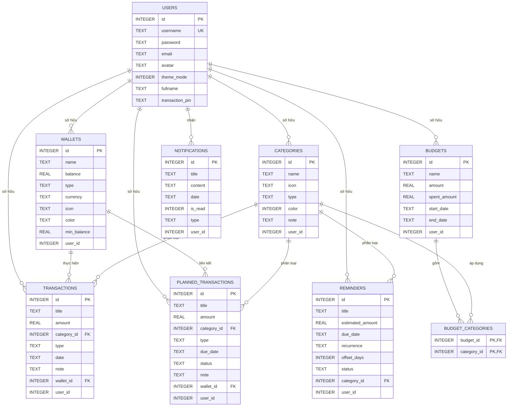

# Tài Liệu Phân Tích Cơ Sở Dữ Liệu - Dự Án Quản Lý Chi Tiêu (Android)

Tài liệu này phân tích chi tiết cấu trúc cơ sở dữ liệu SQLite của ứng dụng Android Quản lý chi tiêu dựa trên mã nguồn thực tế của hệ thống ([DatabaseHelper.java](file:///d:/HocKi_4.2/ANDROID/doan/do_an_android/app/src/main/java/com/example/android_app/database/DatabaseHelper.java) và các lớp DAO trong gói [database](file:///d:/HocKi_4.2/ANDROID/doan/do_an_android/app/src/main/java/com/example/android_app/database)).

---

## 1. Thông Tin Chung
* **Tên cơ sở dữ liệu (Database Name):** `ExpenseManager.db`
* **Phiên bản hiện tại (Database Version):** `14` (Được nâng cấp để chuẩn hóa cấu trúc 1NF cho Ngân sách và chuyển các cột lưu danh mục dạng TEXT sang Khóa ngoại INTEGER liên kết với bảng Danh mục).
* **Hệ quản trị cơ sở dữ liệu:** SQLite (sử dụng thư viện tích hợp sẵn `SQLiteOpenHelper` của Android).
* **Mục đích:** Lưu trữ thông tin tài khoản người dùng, cấu hình ví tiền, danh mục phân loại thu/chi, lịch sử giao dịch thực tế, giao dịch dự kiến (hóa đơn sắp tới), ngân sách chi tiêu, thông báo hệ thống và lịch nhắc hẹn thanh toán định kỳ.

---

## 2. Sơ Đồ Mối Quan Hệ (Entity-Relationship Diagram - ERD)

Dưới đây là sơ đồ Mermaid thể hiện mối quan hệ logic và vật lý giữa các bảng trong cơ sở dữ liệu phiên bản mới nhất (v14):

---

## 3. Cấu Trúc Chi Tiết Các Bảng

### 3.1. Bảng `users` (Quản lý tài khoản người dùng)
Bảng này dùng để lưu thông tin đăng ký, đăng nhập, thông tin cá nhân và cấu hình của từng người dùng.

| Tên Cột | Kiểu Dữ Liệu | Thuộc tính | Mô tả |
| :--- | :--- | :--- | :--- |
| `id` | `INTEGER` | PRIMARY KEY, AUTOINCREMENT | Khóa chính tự động tăng |
| `username` | `TEXT` | UNIQUE, NOT NULL | Tên đăng nhập (phải là duy nhất) |
| `password` | `TEXT` | NOT NULL | Mật khẩu tài khoản (đã băm bảo mật SHA-256) |
| `email` | `TEXT` | | Địa chỉ email người dùng |
| `avatar` | `TEXT` | | Tên tài nguyên hoặc đường dẫn tuyệt đối ảnh đại diện |
| `theme_mode` | `INTEGER` | DEFAULT 0 | Chế độ giao diện (0: Sáng, 1: Tối) |
| `fullname` | `TEXT` | | Họ tên đầy đủ của người dùng (Thêm từ v10) |
| `transaction_pin` | `TEXT` | | Mã PIN bảo mật khi thực hiện giao dịch (Thêm từ v13) |

### 3.2. Bảng `wallets` (Quản lý danh sách ví tiền)
Lưu thông tin các ví hoặc tài khoản tài chính của người dùng (Ví dụ: Tiền mặt, Thẻ ngân hàng, Ví điện tử).

| Tên Cột | Kiểu Dữ Liệu | Thuộc tính | Mô tả |
| :--- | :--- | :--- | :--- |
| `id` | `INTEGER` | PRIMARY KEY, AUTOINCREMENT | Khóa chính tự động tăng |
| `name` | `TEXT` | NOT NULL | Tên ví (Ví dụ: Tiền mặt, BIDV, MoMo) |
| `balance` | `REAL` | NOT NULL | Số dư hiện tại của ví |
| `type` | `TEXT` | | Loại ví (Tiền mặt, Ngân hàng, Ví điện tử) |
| `currency` | `TEXT` | | Đơn vị tiền tệ (Ví dụ: VND, USD) |
| `icon` | `TEXT` | | Tên biểu tượng hiển thị của ví |
| `color` | `TEXT` | | Mã màu nền hiển thị (Hex string) |
| `min_balance` | `REAL` | DEFAULT 0 | Hạn mức số dư tối thiểu để cảnh báo |
| `user_id` | `INTEGER` | | Khóa ngoại liên kết logic tới `users(id)` |

### 3.3. Bảng `categories` (Danh mục chi tiêu/thu nhập)
Định nghĩa phân loại giao dịch (Ví dụ: Ăn uống, Mua sắm, Lương, Thưởng).

| Tên Cột | Kiểu Dữ Liệu | Thuộc tính | Mô tả |
| :--- | :--- | :--- | :--- |
| `id` | `INTEGER` | PRIMARY KEY, AUTOINCREMENT | Khóa chính tự động tăng |
| `name` | `TEXT` | NOT NULL | Tên danh mục (Ví dụ: Mua sắm, Đi lại...) |
| `icon` | `TEXT` | | Tên biểu tượng hiển thị của danh mục |
| `type` | `TEXT` | | Phân loại danh mục (`income` hoặc `expense`) |
| `color` | `INTEGER` | | Giá trị màu sắc của danh mục (dưới dạng Integer) |
| `note` | `TEXT` | | Mô tả thêm hoặc ghi chú về danh mục |
| `user_id` | `INTEGER` | | Khóa ngoại liên kết logic tới `users(id)` |

### 3.4. Bảng `transactions` (Giao dịch tài chính thực tế)
Ghi nhận các hoạt động thu hoặc chi đã thực hiện thành công từ các ví tiền.

| Tên Cột | Kiểu Dữ Liệu | Thuộc tính | Mô tả |
| :--- | :--- | :--- | :--- |
| `id` | `INTEGER` | PRIMARY KEY, AUTOINCREMENT | Khóa chính tự động tăng |
| `title` | `TEXT` | NOT NULL | Tiêu đề giao dịch |
| `amount` | `REAL` | NOT NULL | Số tiền thu hoặc chi |
| `category_id` | `INTEGER` | FOREIGN KEY REFERENCES `categories(id)` | Khóa ngoại liên kết với danh mục (Thay thế cho cột `category` cũ từ v14) |
| `type` | `TEXT` | | Phân loại giao dịch (`income` hoặc `expense`) |
| `date` | `TEXT` | | Ngày giao dịch (Định dạng chuỗi ngày tháng) |
| `note` | `TEXT` | | Chi tiết ghi chú của giao dịch |
| `wallet_id` | `INTEGER` | FOREIGN KEY REFERENCES `wallets(id)` | ID ví thực hiện giao dịch (Khóa ngoại vật lý duy nhất trong DB) |
| `user_id` | `INTEGER` | | Khóa ngoại liên kết logic tới `users(id)` |

### 3.5. Bảng `budgets` (Ngân sách chi tiêu giới hạn)
Lưu thông tin hạn mức chi tiêu được thiết lập cho các nhóm danh mục trong một khoảng thời gian nhất định.

| Tên Cột | Kiểu Dữ Liệu | Thuộc tính | Mô tả |
| :--- | :--- | :--- | :--- |
| `id` | `INTEGER` | PRIMARY KEY, AUTOINCREMENT | Khóa chính tự động tăng |
| `name` | `TEXT` | NOT NULL | Tên của gói ngân sách |
| `amount` | `REAL` | NOT NULL | Hạn mức ngân sách tối đa |
| `spent_amount` | `REAL` | DEFAULT 0 | Số tiền thực tế đã chi tiêu thuộc ngân sách này |
| `start_date` | `TEXT` | | Ngày bắt đầu áp dụng ngân sách |
| `end_date` | `TEXT` | | Ngày kết thúc ngân sách |
| `user_id` | `INTEGER` | | Khóa ngoại liên kết logic tới `users(id)` |

### 3.6. Bảng `budget_categories` (Bảng trung gian liên kết Ngân sách - Danh mục) [MỚI TỪ V14]
Giải quyết mối quan hệ nhiều-nhiều giữa Ngân sách và Danh mục (chuẩn hóa 1NF).

| Tên Cột | Kiểu Dữ Liệu | Thuộc tính | Mô tả |
| :--- | :--- | :--- | :--- |
| `budget_id` | `INTEGER` | PRIMARY KEY, FOREIGN KEY REFERENCES `budgets(id)` ON DELETE CASCADE | Khóa ngoại tham chiếu bảng `budgets` |
| `category_id` | `INTEGER` | PRIMARY KEY, FOREIGN KEY REFERENCES `categories(id)` ON DELETE CASCADE | Khóa ngoại tham chiếu bảng `categories` |

### 3.7. Bảng `planned_transactions` (Giao dịch dự kiến/lên lịch)
Lưu trữ hóa đơn hoặc các giao dịch tương lai cần nhắc nhở hoặc chuẩn bị thanh toán (Ví dụ: Tiền điện, nước, internet định kỳ).

| Tên Cột | Kiểu Dữ Liệu | Thuộc tính | Mô tả |
| :--- | :--- | :--- | :--- |
| `id` | `INTEGER` | PRIMARY KEY, AUTOINCREMENT | Khóa chính tự động tăng |
| `title` | `TEXT` | NOT NULL | Tiêu đề giao dịch dự kiến |
| `amount` | `REAL` | NOT NULL | Số tiền dự kiến |
| `category_id` | `INTEGER` | FOREIGN KEY REFERENCES `categories(id)` | Khóa ngoại liên kết với danh mục (Thay thế cho cột `category` TEXT cũ từ v14) |
| `type` | `TEXT` | | Loại giao dịch (`income` hoặc `expense`) |
| `due_date` | `TEXT` | | Hạn thanh toán (Định dạng chuỗi ngày tháng) |
| `status` | `TEXT` | DEFAULT 'pending' | Trạng thái thanh toán (`pending` hoặc `completed`) |
| `note` | `TEXT` | | Ghi chú thêm |
| `wallet_id` | `INTEGER` | | ID ví dự kiến liên kết thanh toán |
| `user_id` | `INTEGER` | | Khóa ngoại liên kết logic tới `users(id)` |

### 3.8. Bảng `notifications` (Thông báo của hệ thống)
Lưu lịch sử thông báo gửi tới người dùng (Cảnh báo số dư ví, thông báo nhắc nợ/giao dịch dự kiến, vượt hạn mức ngân sách...).

| Tên Cột | Kiểu Dữ Liệu | Thuộc tính | Mô tả |
| :--- | :--- | :--- | :--- |
| `id` | `INTEGER` | PRIMARY KEY, AUTOINCREMENT | Khóa chính tự động tăng |
| `title` | `TEXT` | NOT NULL | Tiêu đề thông báo |
| `content` | `TEXT` | NOT NULL | Nội dung chi tiết của thông báo |
| `date` | `TEXT` | NOT NULL | Thời gian tạo thông báo (chuỗi ngày tháng) |
| `is_read` | `INTEGER` | DEFAULT 0 | Trạng thái đọc (0: chưa đọc, 1: đã đọc) |
| `type` | `TEXT` | | Thể loại thông báo (`system`, `warning`, `transaction`, `reminder`) |
| `user_id` | `INTEGER` | | Khóa ngoại liên kết logic tới `users(id)` |

### 3.9. Bảng `reminders` (Nhắc hẹn thanh toán định kỳ)
Lưu trữ thông tin lịch nhắc hẹn thanh toán/thu tiền định kỳ có thiết lập khoảng cách ngày báo trước và chu kỳ lặp lại.

| Tên Cột | Kiểu Dữ Liệu | Thuộc tính | Mô tả |
| :--- | :--- | :--- | :--- |
| `id` | `INTEGER` | PRIMARY KEY, AUTOINCREMENT | Khóa chính tự động tăng |
| `title` | `TEXT` | NOT NULL | Tiêu đề nhắc hẹn |
| `estimated_amount` | `REAL` | NOT NULL | Số tiền ước tính |
| `due_date` | `TEXT` | NOT NULL | Ngày đến hạn thanh toán |
| `recurrence` | `TEXT` | NOT NULL | Chu kỳ lặp lại (Ví dụ: `DAILY`, `WEEKLY`, `MONTHLY`, `YEARLY`) |
| `offset_days` | `INTEGER` | DEFAULT 0 | Số ngày nhắc nhở trước khi đến hạn |
| `status` | `TEXT` | DEFAULT 'PENDING' | Trạng thái nhắc hẹn (`PENDING`, `COMPLETED`...) |
| `category_id` | `INTEGER` | FOREIGN KEY REFERENCES `categories(id)` | Khóa ngoại liên kết với danh mục (Thay thế cho cột `category` TEXT cũ từ v14) |
| `user_id` | `INTEGER` | | Khóa ngoại liên kết logic tới `users(id)` |

---

## 4. Cơ Chế Nâng Cấp Cơ Sở Dữ Liệu (Database Migration)

Lớp `DatabaseHelper` xử lý cơ chế nâng cấp dữ liệu qua hàm `onUpgrade` theo hướng tăng tiến (progressive upgrade), đảm bảo giữ lại dữ liệu cũ của người dùng mà không làm lỗi ứng dụng:

1. **Phiên bản < 7**: Bổ sung trường `min_balance` cho bảng `wallets` và khởi tạo bảng `planned_transactions`.
2. **Phiên bản 7 lên 8 (oldVersion < 8)**:
   * Bổ sung cột `user_id` vào các bảng tài chính cốt lõi gồm: `wallets`, `categories`, `transactions`, `budgets`, `planned_transactions`.
   * Gán giá trị mặc định `DEFAULT 1` cho các dữ liệu cũ để tránh lỗi dữ liệu bị rỗng (`null`).
3. **Phiên bản 8 lên 9 (oldVersion < 9)**:
   * Khởi tạo thêm bảng `notifications` phục vụ tính năng lưu lịch sử thông báo.
4. **Phiên bản 9 lên 10 (oldVersion < 10)**:
   * Thêm cột `fullname` (TEXT) vào bảng `users` để hỗ trợ hiển thị Họ tên thật của người dùng.
5. **Phiên bản 10 lên 11 (oldVersion < 11)**:
   * Nâng cấp hệ thống danh mục chung (không thay đổi cấu trúc bảng vật lý, duy trì tương thích dữ liệu cũ).
6. **Phiên bản 11 lên 12 (oldVersion < 12)**:
   * Khởi tạo thêm bảng `reminders` để phục vụ tính năng nhắc lịch thanh toán định kỳ.
7. **Phiên bản 12 lên 13 (oldVersion < 13)**:
   * Thêm cột `transaction_pin` (TEXT) vào bảng `users` để hỗ trợ thiết lập mã PIN bảo mật khi thực hiện giao dịch quan trọng.
8. **Phiên bản 13 lên 14 (oldVersion < 14) [MỚI NHẤT]**:
   * Khởi tạo bảng trung gian `budget_categories` để lưu mối liên kết Ngân sách - Danh mục.
   * Quét dữ liệu bảng ngân sách cũ, tách chuỗi `category_ids` phân tách bởi dấu phẩy, tra cứu ID danh mục thực tế tương ứng trong SQLite và di chuyển dữ liệu vào bảng `budget_categories`. Xóa bỏ cột `category_ids` dư thừa trên bảng `budgets` (chuẩn hóa 1NF thành công).
   * Chuyển đổi an toàn kiểu lưu danh mục từ chuỗi (`TEXT`) sang liên kết khóa ngoại (`INTEGER`) cho 3 bảng: `transactions`, `planned_transactions`, `reminders`. Các danh mục cũ tồn tại dưới dạng text được khớp ID hoặc tự động thêm mới vào bảng `categories` nếu bị thiếu để đảm bảo tuyệt đối không làm mất mát liên kết dữ liệu cũ.

---

## 5. Phân Tích & Đánh Giá Thiết Kế CSDL

### 5.1. Ưu Điểm & Các Tối Ưu Hóa Đã Thực Hiện (v14)
1. **Hỗ trợ chế độ đa người dùng (Multi-user Isolation):**
   * Việc tích hợp `user_id` vào toàn bộ các bảng tài chính và cấu hình giúp ứng dụng phân tách triệt để dữ liệu giữa các tài khoản khác nhau trên cùng một thiết bị. Khi người dùng đăng xuất và đăng nhập tài khoản mới, hệ thống tự động tải đúng dữ liệu của người dùng đó.
2. **Thiết kế hỗ trợ tối ưu giao diện cá nhân hóa:**
   * Các trường `color` và `icon` lưu trữ trực tiếp giúp người dùng tự cấu hình giao diện ví tiền, danh mục chi tiêu bắt mắt và trực quan.
3. **Cơ chế Migration mượt mà:**
   * Việc nâng cấp tuần tự qua phương thức `onUpgrade` sử dụng `ALTER TABLE` và các thao tác tạo bảng tạm đảm bảo giữ nguyên vẹn lịch sử giao dịch và tài khoản của người dùng khi ứng dụng phát hành các phiên bản mới hơn.
4. **Bảo mật thông tin cơ bản:**
   * Mật khẩu đăng nhập được mã hóa một chiều băm SHA-256 trước khi lưu xuống bảng `users` và có hỗ trợ cột `transaction_pin` để mở rộng các tính năng bảo mật giao dịch sau này.
5. **Kích hoạt Foreign Key vật lý (Mới ở v14):**
   * Đã bổ sung cơ chế kiểm soát toàn vẹn khóa ngoại bằng cách ghi đè phương thức `onConfigure` trong `DatabaseHelper` và gọi `db.setForeignKeyConstraintsEnabled(true)`. SQLite sẽ tự động ngăn chặn việc chèn bản ghi rác chứa ID không hợp lệ và thực hiện `ON DELETE CASCADE` hiệu quả.
6. **Chuẩn hóa quan hệ Danh mục - Giao dịch (v14):**
   * Chuyển đổi cột danh mục từ `TEXT` sang khóa ngoại `category_id` (INTEGER) giúp loại bỏ dữ liệu dư thừa. Khi người dùng cập nhật biểu tượng hoặc màu sắc danh mục, các giao dịch liên quan sẽ phản ánh chính xác lập tức trên biểu đồ mà không gây mất đồng bộ dữ liệu.
7. **Chuẩn hóa dạng chuẩn 1NF cho Ngân sách (v14):**
   * Thay thế chuỗi danh mục gộp `category_ids` bằng bảng trung gian `budget_categories` giúp thực hiện tính toán tổng tiền chi tiêu của một ngân sách bằng một câu lệnh JOIN duy nhất trong SQL, không cần tải dữ liệu và tách chuỗi thủ công trong Java, cải thiện hiệu năng truy vấn rõ rệt.

### 5.2. Các Lỗi Logic & Nhược Điểm Còn Tồn Tại (Cần Cải Tiến)

Qua quá trình rà soát logic chuyên sâu, dưới đây là các lỗi thiết kế và điểm yếu logic còn tồn tại trong cấu trúc cơ sở dữ liệu hiện tại cần khắc phục trong các phiên bản tương lai:

#### 1. Định dạng lưu trữ Ngày/Tháng (Date Format) không tiêu chuẩn
* **Vấn đề:** Các cột ngày tháng như `date` trong `transactions`, `due_date` trong `planned_transactions`, `due_date` trong `reminders`, v.v., đang được lưu trữ dưới định dạng chuỗi TEXT tự do như `dd/MM/yyyy` hoặc `dd/MM/yyyy HH:mm`.
* **Hậu quả:** 
  * SQLite không có kiểu dữ liệu DATE riêng mà hỗ trợ so sánh/sắp xếp chuỗi ngày tháng theo định dạng ISO-8601 (`YYYY-MM-DD` hoặc `YYYY-MM-DD HH:MM:SS`).
  * Với định dạng `dd/MM/yyyy`, phép so sánh `BETWEEN` mặc định của SQL sẽ hoạt động theo bảng chữ cái (Ví dụ: `"05/12/2023"` sẽ được xếp trước `"12/01/2023"` vì ký tự `'0'` nhỏ hơn `'1'`).
  * Để tính toán ngân sách, mã nguồn hiện tại bắt buộc phải cắt chuỗi bằng hàm SQLite phức tạp và chậm chạp: `(substr(t.date, 7, 4) || '-' || substr(t.date, 4, 2) || '-' || substr(t.date, 1, 2))`.
* **Giải pháp đề xuất:** Đồng bộ hóa tất cả định dạng ngày tháng sang ISO-8601 chuẩn (`YYYY-MM-DD HH:mm:SS`). Hệ thống sẽ thực hiện các truy vấn so sánh thời gian, sắp xếp (ORDER BY), hoặc khoảng ngày trực tiếp rất nhanh mà không cần xử lý chuỗi trung gian.

#### 2. Thiếu ràng buộc Foreign Key vật lý từ các bảng con về bảng `users`
* **Vấn đề:** Mặc dù cơ chế khóa ngoại vật lý đã được bật thông qua `onConfigure`, các cột `user_id` trong hầu hết các bảng như `wallets`, `categories`, `budgets`, `planned_transactions`, `notifications`, và `reminders` chỉ được định nghĩa là cột `INTEGER` đơn thuần mà không khai báo tường minh ràng buộc `FOREIGN KEY(user_id) REFERENCES users(id) ON DELETE CASCADE`.
* **Hậu quả:** Nếu một người dùng bị xóa khỏi bảng `users`, hệ quản trị SQLite không tự động kích hoạt xóa các dữ liệu liên quan ở ví tiền, ngân sách, nhắc hẹn. Điều này dẫn tới hiện tượng dữ liệu mồ côi (orphaned data) chiếm dụng bộ nhớ thiết bị.
* **Giải pháp đề xuất:** Trong lệnh tạo bảng (`CREATE TABLE`), bổ sung khai báo ràng buộc khóa ngoại vật lý đầy đủ:
  `FOREIGN KEY(user_id) REFERENCES users(id) ON DELETE CASCADE`

#### 3. Mã PIN giao dịch (`transaction_pin`) được lưu dưới dạng văn bản thuần (Plain Text)
* **Vấn đề:** Trong khi mật khẩu người dùng (`password`) được mã hóa băm SHA-256 an toàn, cột `transaction_pin` trong bảng `users` lại đang được lưu trữ trực tiếp dưới dạng chuỗi thô.
* **Hậu quả:** Nếu tệp cơ sở dữ liệu bị rò rỉ hoặc bị trích xuất từ thiết bị đã Root, kẻ xấu có thể đọc trực tiếp mã PIN bảo mật giao dịch của người dùng.
* **Giải pháp đề xuất:** Thực hiện băm một chiều (Ví dụ: PBKDF2 hoặc SHA-256 với Salt) đối với mã PIN giao dịch trước khi lưu vào cơ sở dữ liệu, tương tự như mật khẩu đăng nhập.

#### 4. Thiếu ràng buộc duy nhất (Unique Constraint) theo cặp `(user_id, name)`
* **Vấn đề:** Các bảng như `categories` và `wallets` không thiết lập ràng buộc duy nhất cho cặp cột `(user_id, name)`.
* **Hậu quả:** Một người dùng có thể vô tình tạo nhiều danh mục hoặc ví có tên giống hệt nhau (Ví dụ: Có 2 danh mục cùng tên "Ăn uống"). Việc này gây khó khăn cho việc hiển thị trên giao diện và gây bối rối cho người sử dụng khi chọn danh mục hoặc ví.
* **Giải pháp đề xuất:** Bổ sung ràng buộc `UNIQUE` trên cả hai cột:
  `UNIQUE(user_id, name)` cho cả bảng `categories` và `wallets` để đảm bảo tính duy nhất ở tầng cơ sở dữ liệu.

#### 5. Cấu trúc bảng `planned_transactions` thiếu ràng buộc khóa ngoại cho `wallet_id`
* **Vấn đề:** Cột `wallet_id` trong bảng `planned_transactions` được khai báo là kiểu `INTEGER` nhưng không có ràng buộc khóa ngoại thực tế liên kết với bảng `wallets(id)`.
* **Hậu quả:** Người dùng có thể liên kết giao dịch dự kiến với một ID ví không tồn tại hoặc đã bị xóa trước đó.
* **Giải pháp đề xuất:** Bổ sung khai báo khóa ngoại trong lệnh tạo bảng `planned_transactions`:
  `FOREIGN KEY(wallet_id) REFERENCES wallets(id) ON DELETE SET NULL` hoặc `ON DELETE CASCADE`.
