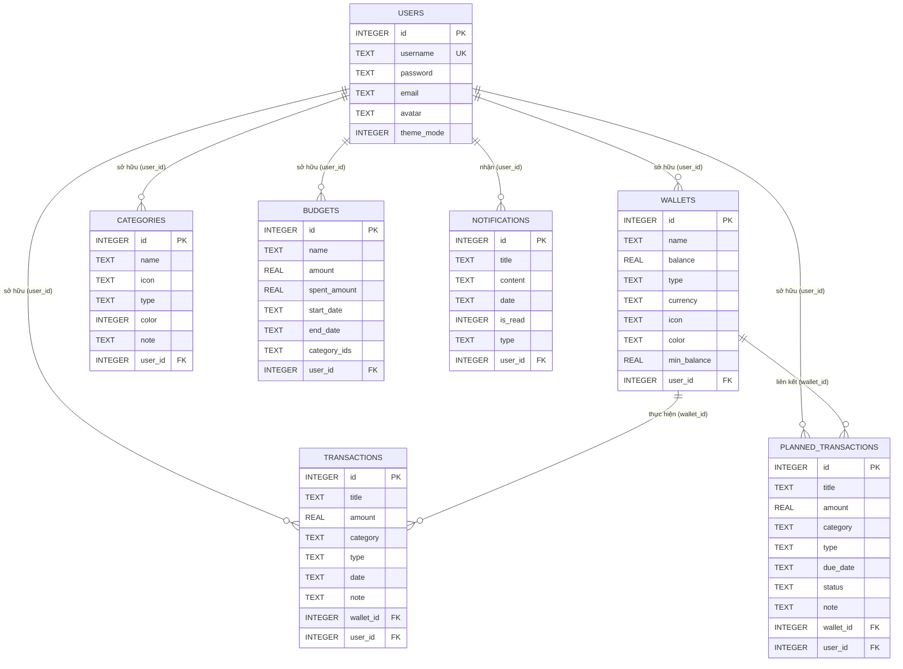

# Tài Liệu Phân Tích Cơ Sở Dữ Liệu - Dự Án Quản Lý Chi Tiêu (Android)

Tài liệu này phân tích chi tiết cấu trúc cơ sở dữ liệu SQLite của ứng dụng Android Quản lý chi tiêu dựa trên mã nguồn thực tế của hệ thống ([DatabaseHelper.java](file:///d:/HocKi_4.2/ANDROID/doan/do_an_android/app/src/main/java/com/example/android_app/database/DatabaseHelper.java) và các lớp DAO trong gói [database](file:///d:/HocKi_4.2/ANDROID/doan/do_an_android/app/src/main/java/com/example/android_app/database)).

---

## 1. Thông Information Chung
* **Tên cơ sở dữ liệu (Database Name):** `ExpenseManager.db`
* **Phiên bản hiện tại (Database Version):** `9` (Cập nhật từ phiên bản cũ `7` lên `9` để bổ sung tính năng quản lý theo từng tài khoản người dùng và hệ thống thông báo).
* **Hệ quản trị cơ sở dữ liệu:** SQLite (sử dụng thư viện tích hợp sẵn `SQLiteOpenHelper` của Android).
* **Mục đích:** Lưu trữ thông tin tài khoản người dùng, cấu hình ví tiền, danh mục phân loại thu/chi, lịch sử giao dịch thực tế, giao dịch dự kiến (hóa đơn sắp tới), ngân sách chi tiêu và thông báo hệ thống.

---

## 2. Sơ Đồ Mối Quan Hệ (Entity-Relationship Diagram - ERD)

Dưới đây là sơ đồ Mermaid thể hiện mối quan hệ logic và vật lý giữa các bảng trong cơ sở dữ liệu phiên bản mới nhất (v9):

---

## 3. Cấu Trúc Chi Tiết Các Bảng

### 3.1. Bảng `users` (Quản lý tài khoản người dùng)
Bảng này dùng để lưu thông tin đăng ký, đăng nhập và cấu hình giao diện (Sáng/Tối) của từng người dùng.

| Tên Cột | Kiểu Dữ Liệu | Thuộc tính | Mô tả |
| :--- | :--- | :--- | :--- |
| `id` | `INTEGER` | PRIMARY KEY, AUTOINCREMENT | Khóa chính tự động tăng |
| `username` | `TEXT` | UNIQUE, NOT NULL | Tên đăng nhập (phải là duy nhất) |
| `password` | `TEXT` | NOT NULL | Mật khẩu tài khoản (đã băm bảo mật) |
| `email` | `TEXT` | | Địa chỉ email người dùng |
| `avatar` | `TEXT` | | Tên tài nguyên hoặc đường dẫn ảnh đại diện |
| `theme_mode` | `INTEGER` | DEFAULT 0 | Chế độ giao diện (0: Sáng, 1: Tối...) |

### 3.2. Bảng `wallets` (Quản lý danh sách ví tiền)
Lưu thông tin các ví hoặc tài khoản tài chính của người dùng (Ví dụ: Tiền mặt, Thẻ ngân hàng, Ví điện tử).

| Tên Cột | Kiểu Dữ Liệu | Thuộc tính | Mô tả |
| :--- | :--- | :--- | :--- |
| `id` | `INTEGER` | PRIMARY KEY, AUTOINCREMENT | Khóa chính tự động tăng |
| `name` | `TEXT` | NOT NULL | Tên ví (Ví dụ: Tiền mặt, BIDV, MoMo) |
| `balance` | `REAL` | NOT NULL | Số dư hiện tại của ví |
| `type` | `TEXT` | | Loại ví (Tiền mặt, Ngân hàng, Ví điện tử) |
| `currency` | `TEXT` | | Đơn vị tiền tệ (Ví dụ: VND, USD) |
| `icon` | `TEXT` | | Tên biểu tượng hiển thị của ví |
| `color` | `TEXT` | | Mã màu nền hiển thị (Hex string) |
| `min_balance` | `REAL` | DEFAULT 0 | Hạn mức số dư tối thiểu để cảnh báo |
| `user_id` | `INTEGER` | | Khóa ngoại liên kết logic tới `users(id)` (v8+) |

### 3.3. Bảng `categories` (Danh mục chi tiêu/thu nhập)
Định nghĩa phân loại giao dịch (Ví dụ: Ăn uống, Mua sắm, Lương, Thưởng).

| Tên Cột | Kiểu Dữ Liệu | Thuộc tính | Mô tả |
| :--- | :--- | :--- | :--- |
| `id` | `INTEGER` | PRIMARY KEY, AUTOINCREMENT | Khóa chính tự động tăng |
| `name` | `TEXT` | NOT NULL | Tên danh mục (Ví dụ: Mua sắm, Đi lại...) |
| `icon` | `TEXT` | | Tên biểu tượng hiển thị của danh mục |
| `type` | `TEXT` | | Phân loại danh mục (`income` hoặc `expense`) |
| `color` | `INTEGER` | | Giá trị màu sắc của danh mục (dưới dạng Integer) |
| `note` | `TEXT` | | Mô tả thêm hoặc ghi chú về danh mục |
| `user_id` | `INTEGER` | | Khóa ngoại liên kết logic tới `users(id)` (v8+) |

### 3.4. Bảng `transactions` (Giao dịch tài chính thực tế)
Ghi nhận các hoạt động thu hoặc chi đã thực hiện thành công từ các ví tiền.

| Tên Cột | Kiểu Dữ Liệu | Thuộc tính | Mô tả |
| :--- | :--- | :--- | :--- |
| `id` | `INTEGER` | PRIMARY KEY, AUTOINCREMENT | Khóa chính tự động tăng |
| `title` | `TEXT` | NOT NULL | Tiêu đề giao dịch |
| `amount` | `REAL` | NOT NULL | Số tiền thu hoặc chi |
| `category` | `TEXT` | | Tên phân loại danh mục (Lưu dạng chuỗi chữ) |
| `type` | `TEXT` | | Phân loại giao dịch (`income` hoặc `expense`) |
| `date` | `TEXT` | | Ngày giao dịch (Định dạng chuỗi ngày tháng) |
| `note` | `TEXT` | | Chi tiết ghi chú của giao dịch |
| `wallet_id` | `INTEGER` | FOREIGN KEY REFERENCES `wallets(id)` | ID ví thực hiện giao dịch (Khóa ngoại vật lý) |
| `user_id` | `INTEGER` | | Khóa ngoại liên kết logic tới `users(id)` (v8+) |

### 3.5. Bảng `budgets` (Ngân sách chi tiêu giới hạn)
Lưu thông tin hạn mức chi tiêu được thiết lập cho các nhóm danh mục trong một khoảng thời gian nhất định.

| Tên Cột | Kiểu Dữ Liệu | Thuộc tính | Mô tả |
| :--- | :--- | :--- | :--- |
| `id` | `INTEGER` | PRIMARY KEY, AUTOINCREMENT | Khóa chính tự động tăng |
| `name` | `TEXT` | NOT NULL | Tên của gói ngân sách |
| `amount` | `REAL` | NOT NULL | Hạn mức ngân sách tối đa |
| `spent_amount` | `REAL` | DEFAULT 0 | Số tiền thực tế đã chi tiêu thuộc ngân sách này |
| `start_date` | `TEXT` | | Ngày bắt đầu áp dụng ngân sách |
| `end_date` | `TEXT` | | Ngày kết thúc ngân sách |
| `category_ids` | `TEXT` | | Chuỗi danh sách ID các danh mục áp dụng (Ví dụ: `"1,2,5"`) |
| `user_id` | `INTEGER` | | Khóa ngoại liên kết logic tới `users(id)` (v8+) |

### 3.6. Bảng `planned_transactions` (Giao dịch dự kiến/lên lịch)
Lưu trữ hóa đơn hoặc các giao dịch tương lai cần nhắc nhở hoặc chuẩn bị thanh toán (Ví dụ: Tiền điện, nước, internet định kỳ).

| Tên Cột | Kiểu Dữ Liệu | Thuộc tính | Mô tả |
| :--- | :--- | :--- | :--- |
| `id` | `INTEGER` | PRIMARY KEY, AUTOINCREMENT | Khóa chính tự động tăng |
| `title` | `TEXT` | NOT NULL | Tiêu đề giao dịch dự kiến |
| `amount` | `REAL` | NOT NULL | Số tiền dự kiến |
| `category` | `TEXT` | | Phân loại danh mục (Dạng chuỗi chữ) |
| `type` | `TEXT` | | Loại giao dịch (`income` hoặc `expense`) |
| `due_date` | `TEXT` | | Hạn thanh toán (Định dạng chuỗi ngày tháng) |
| `status` | `TEXT` | DEFAULT 'pending' | Trạng thái thanh toán (`pending` hoặc `completed`) |
| `note` | `TEXT` | | Ghi chú thêm |
| `wallet_id` | `INTEGER` | | ID ví dự kiến liên kết thanh toán |
| `user_id` | `INTEGER` | | Khóa ngoại liên kết logic tới `users(id)` (v8+) |

### 3.7. Bảng `notifications` (Thông báo của hệ thống)
Lưu lịch sử thông báo gửi tới người dùng (Cảnh báo số dư ví, thông báo nhắc nợ/giao dịch dự kiến, vượt hạn mức ngân sách...).

| Tên Cột | Kiểu Dữ Liệu | Thuộc tính | Mô tả |
| :--- | :--- | :--- | :--- |
| `id` | `INTEGER` | PRIMARY KEY, AUTOINCREMENT | Khóa chính tự động tăng |
| `title` | `TEXT` | NOT NULL | Tiêu đề thông báo |
| `content` | `TEXT` | NOT NULL | Nội dung chi tiết của thông báo |
| `date` | `TEXT` | NOT NULL | Thời gian tạo thông báo (chuỗi ngày tháng) |
| `is_read` | `INTEGER` | DEFAULT 0 | Trạng thái đọc (0: chưa đọc, 1: đã đọc) |
| `type` | `TEXT` | | Thể loại thông báo (`system`, `warning`, `transaction`, `reminder`) |
| `user_id` | `INTEGER` | | Khóa ngoại liên kết logic tới `users(id)` |

---

## 4. Cơ Chế Nâng Cấp Cơ Sở Dữ Liệu (Database Migration)

Lớp `DatabaseHelper` xử lý cơ chế nâng cấp dữ liệu qua hàm `onUpgrade` theo hướng tăng tiến (progressive upgrade), đảm bảo dữ liệu của người dùng không bị xóa sạch khi nâng cấp ứng dụng:

1. **Phiên bản < 7**: Bổ sung trường `min_balance` cho bảng `wallets` và khởi tạo bảng `planned_transactions`.
2. **Phiên bản 7 lên 8 (oldVersion < 8)**: 
   * Bổ sung cột `user_id` vào các bảng tài chính cốt lõi gồm: `wallets`, `categories`, `transactions`, `budgets`, `planned_transactions`.
   * Gán giá trị mặc định `DEFAULT 1` cho các dữ liệu cũ để tránh lỗi dữ liệu bị rỗng (`null`).
3. **Phiên bản 8 lên 9 (oldVersion < 9)**: 
   * Khởi tạo thêm bảng `notifications` để phục vụ tính năng thông báo mới.

*Cách xử lý an toàn:* Toàn bộ các lệnh cập nhật trong `onUpgrade` được bao bọc bằng khối `try-catch` riêng lẻ để ứng dụng không bị dừng đột ngột (crash) nếu cột hoặc bảng đó đã tồn tại trên thiết bị.

---

## 5. Phân Tích & Đánh Giá Thiết Kế CSDL

### 5.1. Ưu Điểm
1. **Hỗ trợ tốt chế độ đa người dùng (Multi-user):** 
   * Việc tích hợp `user_id` vào toàn bộ các bảng tài chính tại phiên bản 8 và 9 giúp ứng dụng có thể hiển thị chính xác dữ liệu của riêng người dùng đang đăng nhập thông qua `SharedPreferences`. Khi đăng xuất và đổi tài khoản khác, dữ liệu sẽ được phân tách hoàn toàn, đảm bảo tính bảo mật và trải nghiệm cá nhân hóa.
2. **Thiết kế hỗ trợ tối ưu UI/UX:** 
   * Lưu các trường `color` và `icon` trực tiếp vào bảng danh mục và ví tiền giúp giao diện ứng dụng linh hoạt. Người dùng có thể tùy biến màu sắc và biểu tượng riêng cho ví và danh mục của mình.
3. **Migration an toàn cho người dùng cuối:** 
   * Việc nâng cấp tuần tự thông qua `ALTER TABLE` giúp giữ lại lịch sử chi tiêu của người dùng cũ từ các phiên bản trước mà không bắt buộc cài đặt lại cơ sở dữ liệu từ đầu.
4. **Phân tách nghiệp vụ rõ ràng:** 
   * Các đối tượng nghiệp vụ cốt lõi như Ngân sách (`budgets`), Giao dịch thực tế (`transactions`), Hóa đơn dự kiến (`planned_transactions`) và Thông báo (`notifications`) được chia thành các thực thể riêng biệt kèm các lớp DAO tương ứng điều hướng dữ liệu.

### 5.2. Nhược Điểm & Đề Xuất Cải Tiến

* **Thiếu ràng buộc Khóa ngoại (Foreign Key) vật lý:**
  * *Vấn đề:* Ngoại trừ bảng `transactions` có định nghĩa khóa ngoại vật lý cho `wallet_id` tham chiếu đến `wallets(id)`, tất cả các cột `user_id` ở các bảng khác cũng như cột `wallet_id` trong `planned_transactions` đều được định nghĩa là cột `INTEGER` bình thường mà không có mệnh đề `FOREIGN KEY REFERENCES`.
  * *Hậu quả:* SQLite không thể kiểm soát tính toàn vẹn tham chiếu. Ví dụ: Nếu một tài khoản người dùng (`users`) bị xóa hoặc một ví tiền (`wallets`) bị xóa, các giao dịch, thông báo hoặc ngân sách liên kết sẽ bị mồ côi (trở thành dữ liệu rác trong hệ thống).
  * *Khuyến nghị:* Thêm ràng buộc `FOREIGN KEY` đầy đủ vào câu lệnh `CREATE TABLE`. Đồng thời cần gọi câu lệnh SQL `db.execSQL("PRAGMA foreign_keys = ON;");` trong phương thức `onConfigure` hoặc `onOpen` của `DatabaseHelper` để SQLite kích hoạt tính năng kiểm tra khóa ngoại (theo mặc định của SQLite trên Android, tính năng này bị tắt).

* **Lưu trữ danh mục dưới dạng văn bản (TEXT) thay vì Khóa ngoại:**
  * *Vấn đề:* Cột `category` trong bảng `transactions` và `planned_transactions` đang lưu trực tiếp tên danh mục dưới dạng chữ (`TEXT`) thay vì tham chiếu đến khóa ngoại `category_id` (`INTEGER` liên kết tới `categories(id)`).
  * *Hậu quả:* Nếu người dùng đổi tên danh mục (ví dụ từ "Ăn uống" thành "Cơm trưa"), các giao dịch cũ vẫn giữ nguyên nhãn cũ là "Ăn uống", gây ra sự không đồng nhất dữ liệu và gây sai lệch, khó khăn khi tổng hợp thống kê biểu đồ theo danh mục.
  * *Khuyến nghị:* Thay thế cột `category` (TEXT) thành cột `category_id` (INTEGER) liên kết khóa ngoại vật lý đến `categories(id)`.

* **Vi phạm chuẩn hóa dạng chuẩn 1 (1NF) trong bảng ngân sách (`budgets`):**
  * *Vấn đề:* Cột `category_ids` trong bảng `budgets` đang lưu danh sách các ID dưới dạng chuỗi phân tách bởi dấu phẩy (ví dụ: `"1,2,5"`).
  * *Hậu quả:* Vi phạm thuộc tính nguyên tố của cơ sở dữ liệu quan hệ (1NF). Khi cần thống kê số tiền đã chi tiêu của các danh mục thuộc ngân sách đó, hệ thống không thể sử dụng các phép `JOIN` SQL thuần túy hiệu quả, mà bắt buộc phải tải chuỗi lên bộ nhớ máy ảo Android, tách mảng bằng code Java rồi thực hiện nhiều truy vấn nhỏ. Điều này sẽ ảnh hưởng lớn đến hiệu năng xử lý khi dữ liệu giao dịch tăng lên.
  * *Khuyến nghị:* Tạo bảng trung gian `budget_categories(budget_id, category_id)` để chuẩn hóa quan hệ Nhiều - Nhiều giữa Ngân sách và Danh mục chi tiêu.
